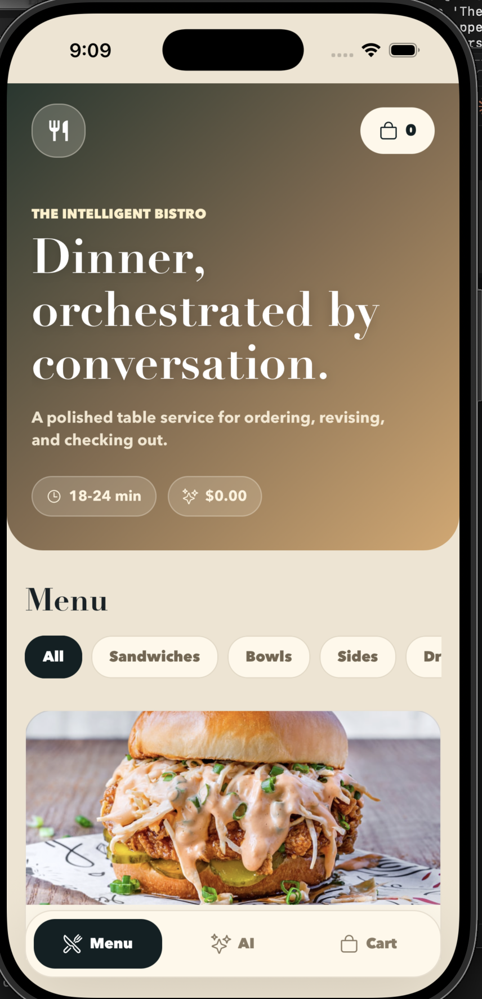
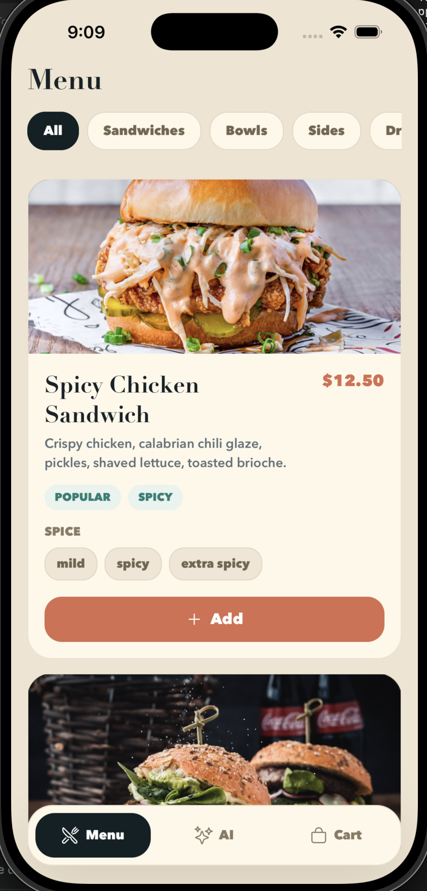
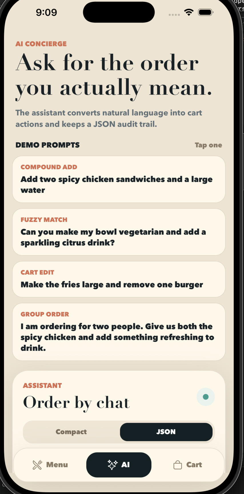
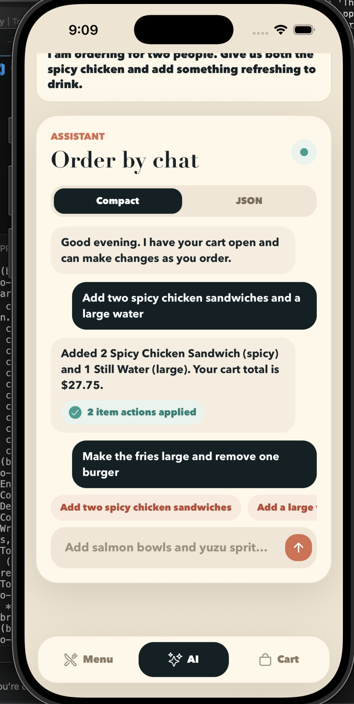
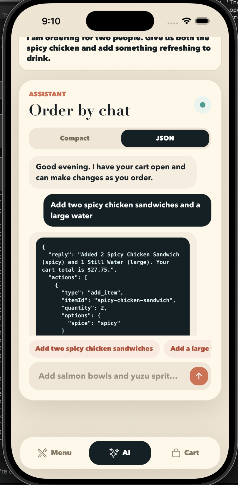
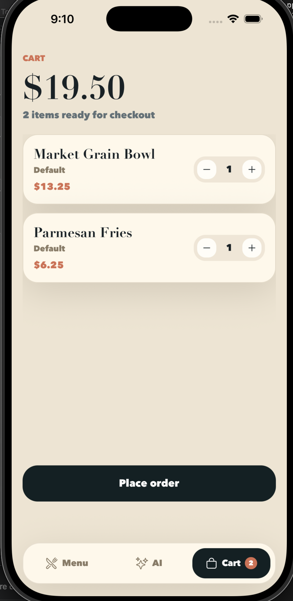

# The Intelligent Bistro

An elegant mobile restaurant ordering experience where guests can browse a polished menu, build a cart, and use natural language to revise their order through an AI concierge.

The project combines an Expo React Native app with a lightweight Node.js API. The backend converts conversational requests such as `Add two spicy chicken sandwiches and a large water` into structured cart actions, applies those actions server-side, and returns an auditable JSON response.

## Project Highlights

- Premium mobile-first restaurant UI with curated menu categories, option selectors, and a refined cart flow.
- AI ordering assistant that supports compound adds, fuzzy item matching, cart edits, and group-style requests.
- JSON audit mode that exposes the assistant's structured actions for transparency and debugging.
- Server-applied cart updates so the mobile app and backend stay consistent.
- Provider-aware AI layer with OpenAI and Anthropic support, plus an offline deterministic parser for demos without API keys.

## Screenshots

<table>
  <tr>
    <td width="33%" align="center">
      
      <br />
      <strong>Menu landing experience</strong>
      <br />
      A cinematic first screen introduces the bistro, cart status, estimated prep time, and the beginning of the menu.
    </td>
    <td width="33%" align="center">
      
      <br />
      <strong>Interactive menu cards</strong>
      <br />
      Menu items include rich photography, pricing, tags, customization options, and a clear add-to-cart action.
    </td>
    <td width="33%" align="center">
      
      <br />
      <strong>AI concierge prompts</strong>
      <br />
      Demo prompts show the assistant handling compound adds, fuzzy matching, cart edits, and group orders.
    </td>
  </tr>
  <tr>
    <td width="33%" align="center">
      
      <br />
      <strong>Conversational ordering</strong>
      <br />
      Compact mode presents the guest's request, the assistant's response, and the number of cart actions applied.
    </td>
    <td width="33%" align="center">
      
      <br />
      <strong>JSON audit trail</strong>
      <br />
      JSON mode reveals the structured response, including reply text, item IDs, quantities, and selected options.
    </td>
    <td width="33%" align="center">
      
      <br />
      <strong>Cart and checkout</strong>
      <br />
      The cart summarizes selected items, quantities, prices, and the final order action in a focused checkout view.
    </td>
  </tr>
</table>

## Tech Stack

- **Mobile:** Expo, React Native, React 19
- **Backend:** Node.js HTTP server with native test runner
- **AI providers:** OpenAI, Anthropic, or local deterministic parsing fallback
- **Architecture:** npm workspaces with separate `mobile` and `server` packages

## Repository Structure

```txt
.
├── mobile/              # Expo React Native application
│   ├── src/components/  # Reusable app UI
│   ├── src/screens/     # Menu, AI assistant, and cart screens
│   ├── src/lib/         # API and cart helpers
│   └── src/data/        # Local menu fallback data
├── server/              # Node.js ordering API
│   ├── src/             # API server, menu, parser, and AI provider logic
│   └── test/            # Parser and AI order tests
└── docs/screenshots/    # README presentation images
```

## Run Locally

Install dependencies:

```sh
npm install
```

Start the backend:

```sh
npm run dev:server
```

Start the Expo app in another terminal:

```sh
npm run dev:mobile
```

The backend defaults to `http://localhost:4000`. If that port is already in use, run the backend on another port and point Expo to it:

```sh
PORT=4001 npm run dev:server
EXPO_PUBLIC_API_URL=http://localhost:4001 npm run dev:mobile
```

For a physical phone, use your computer's LAN address:

```sh
EXPO_PUBLIC_API_URL=http://YOUR_LAN_IP:4000 npm run dev:mobile
```

## AI Configuration

The app works without an API key by using the local parser. To enable a hosted model, create a local `.env` file and provide one of these values:

```sh
OPENAI_API_KEY=sk-your-key
ANTHROPIC_API_KEY=sk-ant-your-key
```

If both keys are present, OpenAI is used by default. To force Anthropic:

```sh
AI_PROVIDER=anthropic
```

## API

### `GET /health`

Returns server status and the active AI provider.

### `GET /menu`

Returns the restaurant menu used by the mobile app.

### `POST /ai/order`

Converts a natural-language request into cart actions and returns the updated cart.

Request:

```json
{
  "message": "Add two spicy chicken sandwiches and a large water",
  "cart": []
}
```

Response:

```json
{
  "reply": "Added 2 Spicy Chicken Sandwich (spicy) and 1 Still Water (large). Your cart total is $27.75.",
  "actions": [
    {
      "type": "add_item",
      "itemId": "spicy-chicken-sandwich",
      "quantity": 2,
      "options": {
        "spice": "spicy"
      }
    }
  ],
  "cart": [
    {
      "itemId": "spicy-chicken-sandwich",
      "name": "Spicy Chicken Sandwich",
      "price": 12.5,
      "quantity": 2,
      "options": {
        "spice": "spicy"
      }
    }
  ]
}
```

## Test

Run the server test suite:

```sh
npm test
```

Current coverage focuses on provider selection, parser behavior, compound add requests, quantity edits, removals, and fuzzy matching.

## Submission Note

The Intelligent Bistro is designed to demonstrate both product polish and engineering clarity: the guest-facing flow feels like a refined restaurant app, while the backend keeps every AI-driven cart mutation structured, testable, and easy to inspect.
